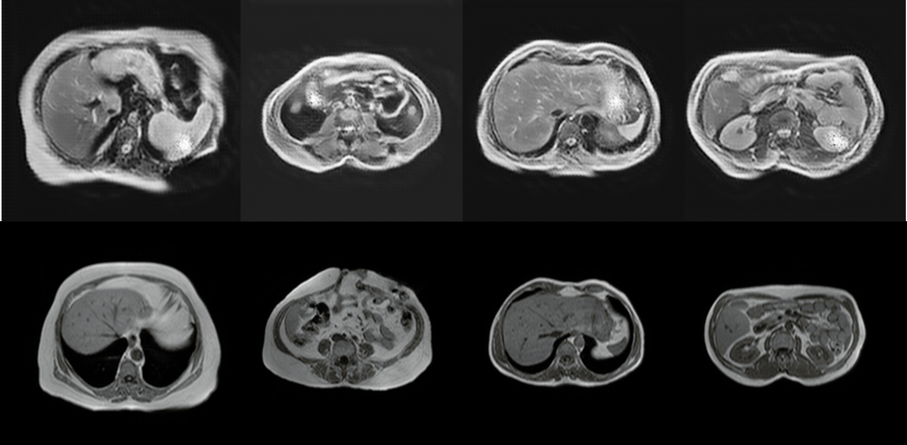

# Domain Adaptation for Medical Images

## Introduction
Deep learning is increasingly used in medical imaging to improve the efficiency, accuracy, and reliability of image-based diagnoses. However, it faces challenges such as the need for large datasets, difficulties in data labeling, privacy concerns, and heterogeneous image datasets. These challenges often cause deep learning models to fail in real clinical practice.

This can be resolved by using domain adaptation techniques, such as the proposed CycleGAN. It learns how to separate normalization statistics and align domain distributions to perform bidirectional transformation without needing labeled data for training. This approach allows the same model to be applied on different types of images.

### CycleGAN Architecture
- Utilized for image-to-image translation, combining three loss components:
  - **Discriminator Loss**
  - **Cycle Loss**
  - **Identity Loss**

## Results
- **Data Comparisons**:
  - **PET-CT to CT**: High data similarity, leading to robust model performance.
  - **MRI dual to MRI spiral**: Low data similarity, presenting more challenges for the model.

<p align="center">  <p/>

- **Evaluation Metrics**:
  - **Structural Similarity Index (SSIM)**: Measures structure and contrast.
  - **Dice Coefficient (DICE)**: Measures the overlap of anatomical shapes.
  - **Score Calculation**: `Score = SSIM x 0.85 + DICE x 0.15`

- **Performance Scores**:
  - CT <--> PET-CT:
    <p align="center">Plot of the score</p>
    <p align="center">  <p/>
    <p align="center">x-axis: epoches [#]; y-axis: performance [%]</p>
    <p align="center">PET-CT synthetic vs PET-CT real</p>
    <p align="center">  <p/>
    <p align="center">CT synthetic vs CT real</p>
    <p align="center">  <p/>
  - MRI Dual <--> MRI Spiral: 
    <p align="center">Plot of the score</p>
    <p align="center">  <p/>
    <p align="center">x-axis: epoches [#]; y-axis: performance [%]</p>
    <p align="center">MRI Dual synthetic vs MRI Dual real</p>
    <p align="center">  <p/>    
    <p align="center">MRI Spir synthetic vs MRI Spir real</p>
    <p align="center">  <p/>
    

## Conclusion
The deep learning model demonstrated robustness, maintaining contrast and anatomical details with consistent performance across different conversion tasks. Future improvements will focus on training with larger datasets and modifying hyperparameters to enhance model performance further. The model will also be tested on more challenging tasks to validate its effectiveness.


</br>
</br>

<details>
    <summary>Instructions</summary>

## Dependencies

This project requires the following libraries:

- pillow==9.2.0
- scikit-image
- pydicom==2.3.1
- imageio==2.22.4
- numpy==1.23.4
- torch==1.13.0
- torchsummary==1.5.1
- matplotlib==3.6.2
- tensorflow==2.11.0
- keras==2.11.0
- tqdm==4.64.1
- torchvision==0.14.0

To install all the requirements, execute on the command prompt:
```bash
pip install -r requirements.txt
```

## Dataset
The dataset must be positioned into the project folder. It must be organized into the following structure.
```
project
└── Data
    ├── folder1
    │   ├── image000.dcm
    │   ├── image001.dcm
    │   └── ...
    └── folder2
        ├── image000.dcm
        ├── image001.dcm
        └── ...

```
`folder1` and `folder2` contain the images corresponding to the two different domains.

## Offline preprocessing
All the DICOM images go through the following steps:
- conversion to PNG images
- resized to 256x256 images
- gantry removal
- converted to 8-bit unsigned integers images

To perform this process, execute on the command prompt:
```bash
python data_preparation.py
```
This command will work with a dataset presented as specified above.
Otherwise, execute:
```bash
python data_preparation.py --path 'Data'
```
changing `--path` according to your needs.

## CycleGAN training

To train the models of the cycleGAN, execute:
```bash
python training.py
```
In alternative, you can execute:
```bash
python training.py --batch_size 8 --learning_rate 0.0002 --epochs 50 --discriminators_epochs 5 --lambda_gp 5 --test_split 0.1 --validation_split 0.2 --save_figs False --save_all False
```
All these parameters can be changed according to your needs.

- `--discriminators_epochs` refers to the number of epochs through which the discriminators are trained during each epoch (e.g., having `--epochs == 50` and `--discriminators_epochs == 5`, discriminators will be trained for 250 epochs).


- `--save_figs`: if set to `True`, saves some images for each epoch. After the training, you will have:
  - `batches` folder with comparison between generated images and real ones.
  - `images` folder with single images of generated and real images


- `--save_all`: if set to `True`, saves networks and decoders for each epoch. After the training, you will have:
  - `models` folder with best models and possibly models from each epoch
  - `optimizers` folder with the optimizers of the saved models

## CycleGan testing

To test the models of the cycleGAN for inference, execute:

```bash
python testing.py
```
In alternative, you can execute:
```bash
python training.py --batch_size 8 --model1 best_G_A2B --model2 best_G_B2A --test_split 0.1 --save_figs False
```
All these parameters can be changed according to your needs.
- `--model1` and `--model2`: string with the name of the saved models (not path)
- `--save_figs`: check the training paragraph

</details>

## Authors
- Davide Console
- Laura Ginestretti
